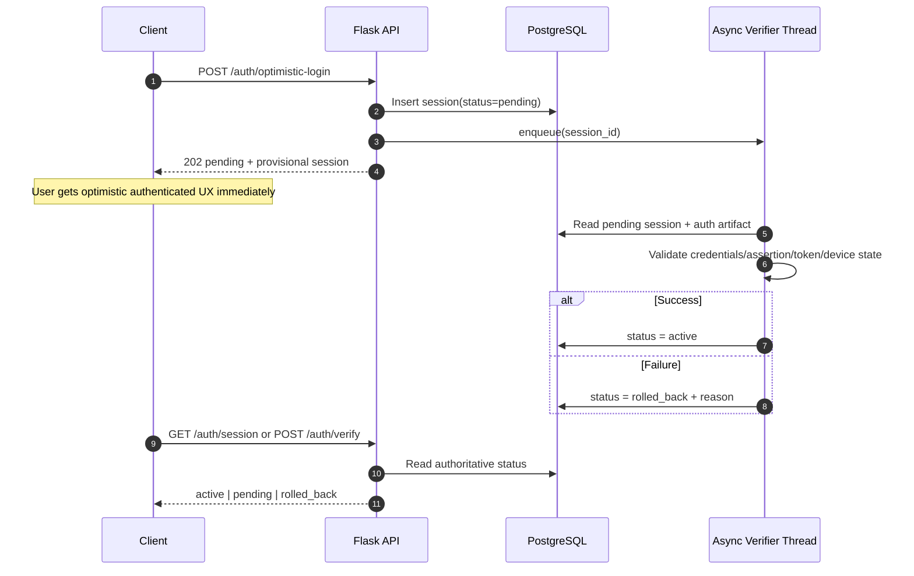
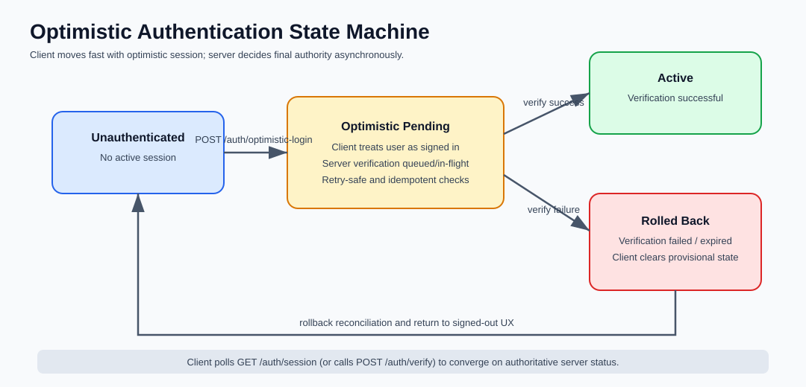

<div align="center">

# 🚀 Optimistic Authentication Systems

**10 production-style auth flow demos using Flask + PostgreSQL + Docker**

Optimistic UX first. Authoritative backend verification always.

[](#tech-stack)
[](#tech-stack)
[](#tech-stack)
[](#quick-start)
[](./LICENSE)

</div>

---

## ✨ Overview

This repository contains **10 independent authentication implementations** that all follow the same product behavior:

- user gets an authenticated UI state immediately,
- backend verification completes asynchronously,
- failed verification triggers deterministic rollback,
- client reconciles state with authoritative session endpoints.

Each folder is standalone and can be run independently.

## 📦 Included Auth Variants

1. `optimistic-email-password`
2. `optimistic-magic-link`
3. `optimistic-oauth-provisional`
4. `optimistic-device-code`
5. `optimistic-webauthn`
6. `optimistic-sms-otp`
7. `optimistic-sso`
8. `optimistic-refresh-rotation`
9. `optimistic-anonymous-upgrade`
10. `optimistic-multi-device-sync`

## 🧰 Tech Stack

- **Backend:** Flask
- **Database:** PostgreSQL
- **ORM:** SQLAlchemy
- **Infra:** Docker + Docker Compose
- **Execution model:** API request + background verification worker

## ⚙️ How It Works



## 🗂️ Repository Structure

```text
.
├── README.md
├── LICENSE
├── assets/
│   └── optimistic-auth-state-machine.svg
├── optimistic-email-password/
├── optimistic-magic-link/
├── optimistic-oauth-provisional/
├── optimistic-device-code/
├── optimistic-webauthn/
├── optimistic-sms-otp/
├── optimistic-sso/
├── optimistic-refresh-rotation/
├── optimistic-anonymous-upgrade/
└── optimistic-multi-device-sync/
```

Every variant includes:

- `backend/app.py`
- `backend/requirements.txt`
- `docker-compose.yml`
- a variant-level `README.md`

## ▶️ Quick Start

```bash
cd optimistic-email-password
docker compose up --build
```

Then open another variant folder and run it the same way to compare implementation patterns.

## 🔌 Shared API Contract

All variants expose:

- `POST /auth/optimistic-login`
- `POST /auth/verify`
- `GET /auth/session`

State transitions are monotonic:

- `pending -> active`
- `pending -> rolled_back`

## 🖼️ Auth State Machine



## 🤝 Contributing

Contributions that improve docs, consistency, and auth-flow robustness are welcome.

If you add a new variant, keep the same optimistic contract and include a variant `README.md` with endpoint examples.

## 📄 License

Licensed under the **MIT License**. See [LICENSE](./LICENSE).
