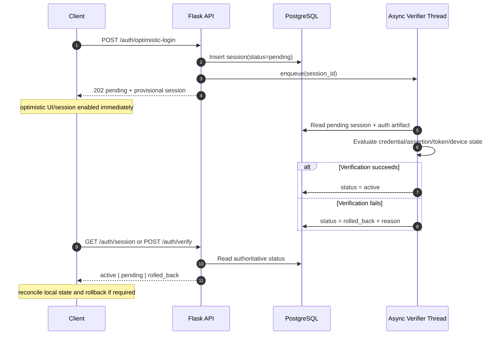

# Optimistic Authentication Systems (Flask + PostgreSQL)

This repository contains **10 independent top-level authentication system implementations** that all follow the same product behavior pattern:

- the client enters an authenticated UX state immediately,
- backend verification finishes asynchronously,
- failed verification triggers deterministic rollback,
- client reconciles state through authoritative session endpoints.

## Systems Included

1. `optimistic-email-password`
2. `optimistic-magic-link`
3. `optimistic-oauth-provisional`
4. `optimistic-device-code`
5. `optimistic-webauthn`
6. `optimistic-sms-otp`
7. `optimistic-sso`
8. `optimistic-refresh-rotation`
9. `optimistic-anonymous-upgrade`
10. `optimistic-multi-device-sync`

## Repository Topology

```mermaid
flowchart TB
    R[Repo Root] --> A[optimistic-email-password]
    R --> B[optimistic-magic-link]
    R --> C[optimistic-oauth-provisional]
    R --> D[optimistic-device-code]
    R --> E[optimistic-webauthn]
    R --> F[optimistic-sms-otp]
    R --> G[optimistic-sso]
    R --> H[optimistic-refresh-rotation]
    R --> I[optimistic-anonymous-upgrade]
    R --> J[optimistic-multi-device-sync]

    A --> A1[backend app.py]
    B --> B1[backend app.py]
    C --> C1[backend app.py]
    D --> D1[backend app.py]
    E --> E1[backend app.py]
    F --> F1[backend app.py]
    G --> G1[backend app.py]
    H --> H1[backend app.py]
    I --> I1[backend app.py]
    J --> J1[backend app.py]

    A --> A2[docker-compose.yml]
    B --> B2[docker-compose.yml]
    C --> C2[docker-compose.yml]
    D --> D2[docker-compose.yml]
    E --> E2[docker-compose.yml]
    F --> F2[docker-compose.yml]
    G --> G2[docker-compose.yml]
    H --> H2[docker-compose.yml]
    I --> I2[docker-compose.yml]
    J --> J2[docker-compose.yml]

    A --> A3[README.md]
    B --> B3[README.md]
    C --> C3[README.md]
    D --> D3[README.md]
    E --> E3[README.md]
    F --> F3[README.md]
    G --> G3[README.md]
    H --> H3[README.md]
    I --> I3[README.md]
    J --> J3[README.md]
```



## Optimistic Authentication Lifecycle



## Visual Illustration


## Shared Contract Across Variants

Every variant exposes:

- `POST /auth/optimistic-login`
- `POST /auth/verify`
- `GET /auth/session`

All variants persist auth/session artifacts in PostgreSQL with SQLAlchemy and run async verification with an in-process worker thread.

## Quick Start

Choose any system folder and run it independently:

```bash
cd optimistic-email-password
cp .env.example .env
docker compose up --build
```

Then repeat with another folder to compare architecture and rollback behavior.
